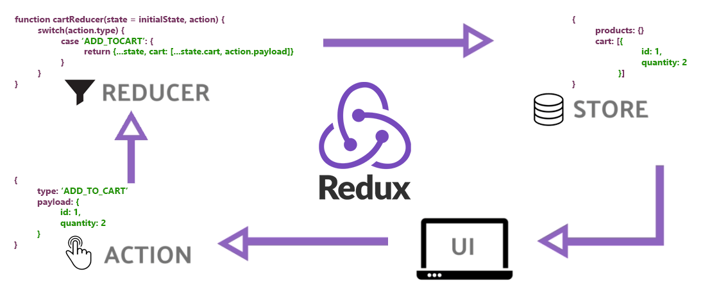

  
  
  

<!-- PROJECT LOGO -->
 

  

  <h1 align="center">Redux Essentials Tutorial</h1>
  <h2><i>Redux Official Tutorials</i></h2>

The [Redux Essentials](https://redux.js.org/tutorials/essentials/part-1-overview-concepts) tutorial is a "top-down" tutorial that teaches "how to use Redux the right way", using our latest recommended APIs and best practices. This tutorial will introduce you to Redux and teach you how to use it the right way, using our latest recommended tools and best practices. By the time you finish, you should be able to start building your own Redux applications using the tools and patterns you've learned here.

## Schedule

- In Part 1 of this tutorial, we'll cover the key concepts and terms you need to know to use Redux.
- In Part 2: Redux App Structure we'll examine a basic React + Redux app to see how the pieces fit together.
- Starting in Part 3: Basic Redux Data Flow, we'll use that knowledge to build a small social media feed app with some real-world features, see how those pieces actually work in practice, and talk about some important patterns and guidelines for using Redux.

## Prerequisites

- Familiarity with `HTML` & `CSS`.
- Familiarity with `ES6` syntax and features
- Knowledge of `React` terminology: JSX, State, Function Components, Props, and Hooks
- Knowledge of asynchronous `JavaScript` and making `AJAX` requests

## License

Distributed under the MIT License. See `LICENSE.txt` for more information.